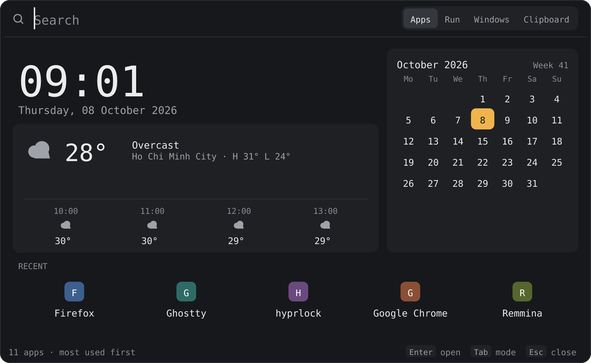
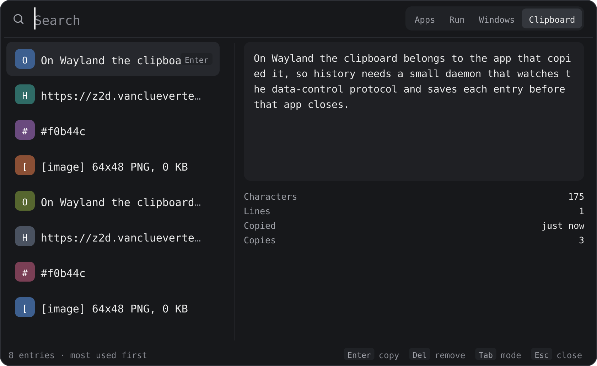

# zofi

A rofi-style application launcher for Wayland/Hyprland, written in pure Zig. Fast startup, no C where the OS doesn't require it, drawn with [z2d](https://github.com/vancluever/z2d) and rendered through its own Wayland client.

## Screenshots

| App launcher | Idle dashboard | Clipboard history |
|---|---|---|
|  |  |  |

- **App launcher** — fuzzy search over `.desktop` entries, matched characters highlighted.
- **Dashboard** — the default idle view: clock, calendar, weather, and most-recently-used apps.
- **Clipboard** — history picker backed by a background daemon, with a preview pane.

## Usage

```
zofi                       Default: app launcher with clock/calendar/recents
zofi -show drun            Launch an application (.desktop entries)
zofi -show run             Launch a command from $PATH
zofi -show windows         Switch between open windows
zofi -show clipboard       Pick from clipboard history, copy it back
zofi -dmenu                Pick a line from stdin, print it to stdout
echo -e "a\nb" | zofi -dmenu
zofi -h | --help | help    Show this message
```

dmenu options (rofi-compatible):

```
-p TEXT                          Prompt label shown left of the input
-display-columns N[,M...]        Show only these 1-indexed columns
-display-column-separator SEP    Column separator (default: tab)
```

Environment:

```
ZOFI_DEBUG=1      Verbose logging to stderr
ZOFI_BROWSER=cmd  Browser used to open URL-shaped queries (default: firefox)
TERMINAL=cmd      Terminal used to launch terminal .desktop entries
```

Clipboard history (`-show clipboard`) needs a background listener running: `zofi --clipboard-daemon`, normally started once via systemd --user (see `contrib/systemd/zofi-clipboard.service`).

## Building

Needs Zig 0.16.x and, on Linux, Wayland/xkbcommon/sqlite headers for `pkg-config`. A `shell.nix` is provided:

```
nix-shell --run "zig build"
```

```
zig build run      # run the launcher
zig build test     # run the test suite
zig build snapshot # render mock UI states to PNGs (used for the screenshots above)
```

## Project layout

```
zofi/
├── build.zig / build.zig.zon
├── protocols/          Wayland XML: wayland, xdg-shell, wlr-layer-shell, wlr-foreign-toplevel-management
├── tools/snapshot.zig  renders fixed mock UI states to PNGs, no compositor needed
└── src/
    ├── main.zig        CLI args, mode selection, run, output/launch
    ├── core/            platform-independent: fuzzy matching, state, rendering, sources, clipboard, history, weather
    └── platform/
        └── wayland/     wire protocol, backend, shm, keyboard
```

See [`INSTRUCTION.md`](INSTRUCTION.md) for the original design plan and phase breakdown.
